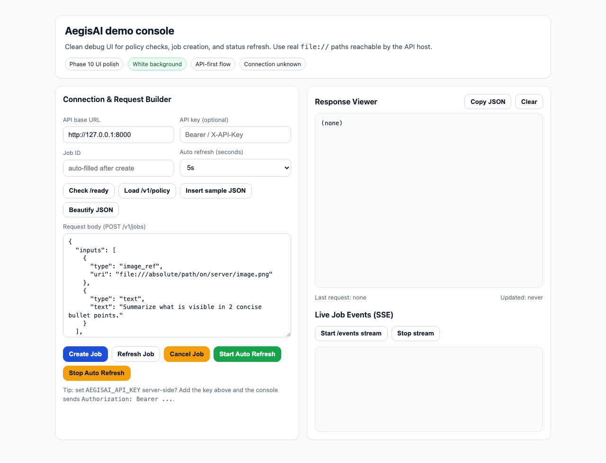
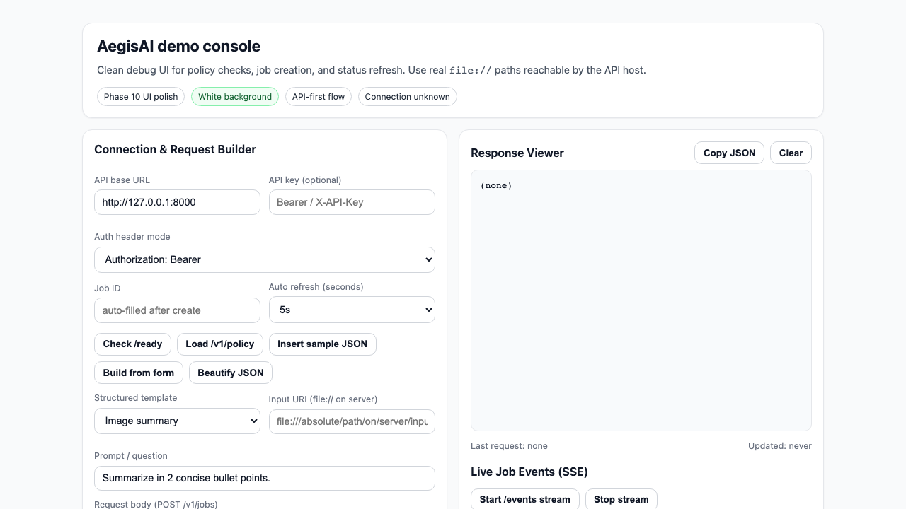

# AegisAI

[](https://github.com/Phani3108/AegisAI/actions/workflows/ci.yml)

**Local-first multimodal API** — vision → LLM → RAG — with optional hybrid routing, DLP-style gates, Chroma persistence, metrics, and deployment sketches (Docker, Helm). Designed for an **enterprise privacy** posture: run inference next to your data; control what leaves the machine via policy.

**Repository:** [github.com/Phani3108/AegisAI](https://github.com/Phani3108/AegisAI)  
**Docs:** [planning.md](planning.md) (architecture & tiers) · [docs/strategy/expansion_roadmap.md](docs/strategy/expansion_roadmap.md) (industries, personas, integrations) · [tasks.md](tasks.md) (checklist) · [LOG.md](LOG.md) (changelog) · [docs/integrators/SDK.md](docs/integrators/SDK.md) (OpenAPI / clients)

**Status:** Phases **0–21** shipped (see roadmap table below). CI runs **Ruff**, **pytest** (3.11 + 3.12), package **build**, and **Docker image build**. Optional extras: **`aegisai[otel]`**, **`aegisai[redis]`**, **`aegisai[s3]`** (S3 connector fetch).

---

## Table of contents

- [Why AegisAI](#why-aegisai)
- [Capability roadmap (phases)](#capability-roadmap-phases)
- [Stack](#stack)
- [Prerequisites](#prerequisites)
- [Quickstart: Docker Compose](#quickstart-docker-compose)
- [Quickstart: local Python](#quickstart-local-python)
- [Smoke checks & examples](#smoke-checks--examples)
- [Five-minute path](#five-minute-path)
- [Screenshots](#screenshots)
- [Integrators (OpenAPI / clients)](#integrators-openapi--clients)
- [HTTP API summary](#http-api-summary)
- [Job request model](#job-request-model)
- [Configuration (environment)](#configuration-environment)
- [Security & privacy](#security--privacy)
- [Observability](#observability)
- [Benchmarks & Helm](#benchmarks--helm)
- [Development & QA](#development--qa)
- [Repository layout](#repository-layout)
- [License](#license)

---

## Why AegisAI

- **Multimodal jobs** — `image_ref`, `video_ref` (ffmpeg), `document_ref` (ephemeral RAG), `audio_ref` (ASR), `video_transcribe` (audio-only from video), `rag_collection` (Chroma).
- **Policy-gated hybrid** — YAML routing; kill switch; optional DLP regex gate on hybrid requests.
- **Operations** — idempotency, optional API key, concurrency caps (429), cancel + progress (SSE/WebSocket), Prometheus metrics.
- **Bounded & streaming chat** — `POST /v1/query` (sync), `POST /v1/stream/chat` (SSE to Ollama).
- **Structured answers** — `JobRequest.output_schema` → Ollama JSON mode + parsed object in `result.structured`.

---

## Five-minute path

1. **Compose:** `docker compose up --build` from the repo root; pull Ollama models (see [Quickstart: Docker Compose](#quickstart-docker-compose)).
2. **Policy:** `curl -s http://127.0.0.1:8000/v1/policy | python -m json.tool` — confirm routing rules.
3. **Job:** `POST /v1/jobs` with an `image_ref` + `text` question ([HTTP API summary](#http-api-summary) and [examples/http/smoke.http](examples/http/smoke.http)).
4. **Progress:** `GET /v1/jobs/{id}` or SSE `/v1/jobs/{id}/events` until terminal status.
5. **Ops:** `GET /metrics` or `GET /v1/metrics?format=prometheus` for counters.

Optional **browser demo:** [examples/demo-ui/](examples/demo-ui/) — **AegisAI Lab** UI (Google Labs–style layout, desert-sand theme, pipeline designer, collections loader, SSE with auth).

---

## Screenshots

Simple carousel view (open one slide at a time):

<details>
  <summary>Slide 1/4 — Home</summary>
  
</details>

<details>
  <summary>Slide 2/4 — Sample job request</summary>
  
</details>

<details>
  <summary>Slide 3/4 — Auto-refresh state</summary>
  
</details>

<details>
  <summary>Slide 4/4 — Frontend launch on port 7001</summary>
  
</details>

---

## Integrators (OpenAPI / clients)

- **Live schema:** `/openapi.json` · **Swagger UI:** `/docs`
- **Copy-paste requests:** [examples/http/smoke.http](examples/http/smoke.http)
- **Generating Python / TypeScript clients:** [docs/integrators/SDK.md](docs/integrators/SDK.md)

---

## Operations

- **Scale/failover runbook:** [docs/operations/scale_validation.md](docs/operations/scale_validation.md)
- **Release checklist:** [docs/operations/release_checklist.md](docs/operations/release_checklist.md)
- **Baseline benchmark script:** `python scripts/benchmark_baseline.py`

### Known limits

- Throughput is model and hardware bound (Ollama host CPU/GPU dominates latency).
- Browser SSE streams require stable network and client reconnect logic for long runs.
- Multi-replica distributed semantics are strongest when Redis is enabled.

---

## Capability roadmap (phases)

| Phase | Focus | Highlights |
|-------|--------|------------|
| **0** | Core lab | FastAPI, async jobs, image/video/RAG pipelines, benchmarks v0 |
| **1+** | Product API | Hybrid policy, Chroma + collections, SSE stream chat, OTEL optional |
| **2** | T1 guardrails | `AEGISAI_API_KEY`, `MAX_CONCURRENT_JOBS`, `Idempotency-Key`, in-package benchmarks |
| **3** | Real-time UX | `POST /v1/query`, job SSE `/v1/jobs/{id}/events`, `output_schema` → JSON |
| **4** | Control | `POST .../cancel`, WebSocket `/v1/ws/jobs/{id}`, cancel metrics, **`scripts/qa_verify.sh`** in CI |
| **5** | Packaging | **Dockerfile**, **docker-compose** (Ollama + app), **`GET /version`** |
| **6** | Ops polish | **`AEGISAI_LOG_JSON`**, WebSocket API-key parity (header / query), **Docker build in CI** |
| **7** | K8s probes | **`GET /live`**, **`GET /ready`** (Ollama + Chroma writable), Helm **`livenessProbe` / `readinessProbe`**, shared [`readiness`](src/aegisai/services/readiness.py) |
| **8** | T1 throttling | **`AEGISAI_RATE_LIMIT_PER_MINUTE`** — rolling cap on **`/v1/*`** per client IP (**429** + `Retry-After`); counter **`aegisai_http_429_rate_limited_total`** (in-process by default) |
| **9** | Integrator & scale | OpenAPI polish; **[examples/http/smoke.http](examples/http/smoke.http)**; optional **Redis** (**`AEGISAI_REDIS_URL`** + **`aegisai[redis]`**) for **Idempotency-Key** + rate limit across replicas; **[examples/demo-ui/](examples/demo-ui/)** |
| **10** | Frontend polish | Demo UI refresh with **white background**, improved cards/buttons, readiness check, job auto-refresh, and response utilities |
| **11** | Frontend realtime UX | Demo UI adds **cancel job** action and **live SSE events viewer** (`/v1/jobs/{id}/events`) to make job progress easier to track |
| **12** | Docs UX | Added demo screenshots in simple README carousel format for quick visual onboarding |
| **13** | Durable jobs | Added disk-backed persisted job/request state + startup recovery for queued/running jobs |
| **14** | Distributed controls | Added idempotency payload fingerprint checks, Redis-backed distributed cancellation path, and retry/dead-letter counters |
| **15** | Resilience observability | Added Ollama retry/backoff wrappers, request-id log context, and latency p95/p99 metrics |
| **16** | Security governance | Added JWT/API-key auth modes, optional protected ops endpoints, and role-aware hybrid policy controls |
| **17** | Operator UX | Demo UI now supports authenticated SSE streaming headers and structured payload templates |
| **18** | Scale + release | Added production Helm defaults plus scale/failover runbook and release checklist |

Scene-based video sampling, DLP prototype, and Helm chart are in-tree; see [tasks.md](tasks.md).

---

## Stack

- **Python 3.11+**, **FastAPI**, **Uvicorn**, **Pydantic v2 / pydantic-settings**
- **Ollama** — chat, vision, embeddings
- **Chroma** — persistent vector store
- **ffmpeg** — video keyframes / scene sampling (host or container)

---

## Prerequisites

- **CPU/RAM** suitable for your chosen Ollama models.
- **Ollama** installed on the host *or* run via **Docker Compose** below.
- **ffmpeg** on `PATH` for video jobs (included in the container image).

---

## Quickstart: Docker Compose

From the repo root:

```bash
docker compose up --build
```

Then pull models inside the Ollama container (once):

```bash
docker compose exec ollama ollama pull llama3.2
docker compose exec ollama ollama pull llava
docker compose exec ollama ollama pull nomic-embed-text
```

- **API:** [http://127.0.0.1:8000/docs](http://127.0.0.1:8000/docs)
- **Ollama:** `http://127.0.0.1:11434` (mapped from the `ollama` service)

The app container sets `AEGISAI_OLLAMA_BASE_URL=http://ollama:11434`, persists Chroma under a Docker volume, and mounts the routing policy from `/app/config/routing_policy.yaml`.

**Single image (bring your own Ollama):**

```bash
docker build -t aegisai:local .
docker run --rm -p 8000:8000 \
  -e AEGISAI_OLLAMA_BASE_URL=http://host.docker.internal:11434 \
  -v aegisai-chroma:/data/chroma \
  aegisai:local
```

(Use `host.docker.internal` on Docker Desktop; on Linux use the host bridge IP or `--network host`.)

---

## Quickstart: local Python

### 1. Ollama (host)

```bash
ollama pull llama3.2
ollama pull llava
ollama pull nomic-embed-text
ollama list
```

### 2. Virtualenv & install

```bash
cd /path/to/AegisAI
python3.11 -m venv .venv
source .venv/bin/activate   # Windows: .venv\Scripts\activate
pip install -e ".[dev]"
# Optional: OpenTelemetry → pip install -e ".[dev,otel]"
# Optional: Redis-backed idempotency / rate limit → pip install -e ".[dev,redis]"
```

Copy [.env.example](.env.example) to `.env` and adjust.

### 3. Run

```bash
uvicorn aegisai.main:app --reload --host 127.0.0.1 --port 8000
```

Open [http://127.0.0.1:8000/docs](http://127.0.0.1:8000/docs).

---

## Smoke checks & examples

**Liveness & version** (no auth; useful behind load balancers):

```bash
curl -s http://127.0.0.1:8000/health | python -m json.tool
curl -s http://127.0.0.1:8000/version | python -m json.tool
```

**Readiness** (Ollama + Chroma; **no API key** — same check as Kubernetes `readinessProbe`):

```bash
curl -s http://127.0.0.1:8000/ready | python -m json.tool
```

(Use **`GET /v1/ready`** only if you omit `AEGISAI_API_KEY`, or send **`Authorization: Bearer …`** / **`X-API-Key`** when the key is set.)

**Image job** — use an absolute `file://` URI; if `AEGISAI_MEDIA_ROOT` is set, the file must sit under that directory:

```bash
curl -s -X POST http://127.0.0.1:8000/v1/jobs \
  -H "Content-Type: application/json" \
  -d '{"inputs":[{"type":"image_ref","uri":"file:///absolute/path/to/image.png"},{"type":"text","text":"What is in this image?"}],"sensitivity_label":"internal","mode":"local_only"}' \
  | python -m json.tool
```

Poll job status:

```bash
curl -s http://127.0.0.1:8000/v1/jobs/<job_id> | python -m json.tool
```

**Sync chat** (bounded timeout `AEGISAI_QUERY_TIMEOUT_S`):

```bash
curl -s -X POST http://127.0.0.1:8000/v1/query \
  -H "Content-Type: application/json" \
  -d '{"model":"llama3.2","messages":[{"role":"user","content":"Hello"}]}' | python -m json.tool
```

**Benchmark v0** (requires Ollama + models):

```bash
python benchmarks/run_v0.py /absolute/path/to/image.png --question "Summarize visible text."
```

---

## HTTP API summary

| Method | Path | Purpose |
|--------|------|---------|
| GET | `/health` | Simple OK (legacy / general) |
| GET | `/live` | **Liveness** — process up (Kubernetes **livenessProbe**) |
| GET | `/ready` | **Readiness** — Ollama + Chroma dir (Kubernetes **readinessProbe**; no API key) |
| GET | `/version` | Package name + version |
| GET | `/metrics` | Prometheus scrape (text) |
| GET | `/v1/ready` | Same readiness as `/ready`, under **`/v1`** (API key applies when set) |
| GET | `/v1/policy` | Effective hybrid routing JSON |
| GET | `/v1/metrics` | JSON metrics; `?format=prometheus` |
| POST | `/v1/jobs` | Create async job (`Idempotency-Key` optional) |
| GET | `/v1/jobs/{id}` | Job status + events + result |
| POST | `/v1/jobs/{id}/cancel` | Request cooperative cancellation |
| GET | `/v1/jobs/{id}/events` | SSE job event stream → `[DONE]` |
| WS | `/v1/ws/jobs/{id}` | WebSocket job events → `{type: done}` (if `AEGISAI_API_KEY` is set: same Bearer / `X-API-Key` as HTTP, or `?api_key=` on the query string) |
| GET | `/v1/jobs/{id}/audit` | Events JSON; `?format=ndjson` |
| POST | `/v1/stream/chat` | SSE stream to Ollama |
| POST | `/v1/query` | Sync non-streaming chat |
| — | `/v1/collections/*` | Chroma collection CRUD + ingest |

Interactive OpenAPI: `/docs`, `/redoc`.

When **`AEGISAI_API_KEY`** is set, **`/v1/*`** requires `Authorization: Bearer <key>` or `X-API-Key` (except public paths: `/health`, **`/live`**, **`/ready`**, `/version`, `/metrics`, docs, OpenAPI).

---

## Job request model

- **`inputs[]`** — `image_ref` | `video_ref` | `document_ref` | `audio_ref` | `text` (exactly one media type per job unless using `rag_collection`-only jobs). Optional **`video_transcribe`: true** with `video_ref` skips frame vision and runs transcription (ffmpeg + ASR).
- **`sensitivity_label`** — `public` \| `internal` \| `confidential` \| `regulated`.
- **`mode`** — `local_only` \| `hybrid` (enforced against [config/routing_policy.yaml](config/routing_policy.yaml)).
- **`video_sampling`** — `max_frames`, optional `fps`, optional **`scene_detection`** + **`scene_threshold`**.
- **`rag_collection`** — Chroma collection name + text question (no other media).
- **`output_schema`** — If set, final LLM step uses JSON mode; parse under `result.structured.parsed`.

Every job gets an initial **`policy`** event; failures and latencies are recorded in **`JobEvent`** (audit-friendly, no raw secrets).

---

## Configuration (environment)

All settings use the **`AEGISAI_`** prefix (see [.env.example](.env.example)).

| Variable | Default | Meaning |
|----------|---------|---------|
| `AEGISAI_OLLAMA_BASE_URL` | `http://127.0.0.1:11434` | Ollama base URL |
| `AEGISAI_INFERENCE_BACKEND` | `ollama` | Inference driver (extensible; today only **ollama**) |
| `AEGISAI_CONNECTOR_REMOTE_ENABLED` | `false` | Allow **https://** / **s3://** URIs in jobs + `source_uri` ingest (allowlists required) |
| `AEGISAI_CONNECTOR_HTTPS_HOSTS_ALLOWLIST` | _(unset)_ | Comma-separated hosts allowed after redirects (HTTPS fetch) |
| `AEGISAI_CONNECTOR_S3_BUCKET_ALLOWLIST` | _(unset)_ | Comma-separated buckets for **s3://** (`pip install 'aegisai[s3]'`) |
| `AEGISAI_CONNECTOR_MAX_FETCH_BYTES` | `50000000` | Per-fetch byte cap |
| `AEGISAI_CONNECTOR_INGEST_MAX_CONCURRENT` | `8` | Parallel **source_uri** fetches per collection batch |
| `AEGISAI_ASR_STUB` | `true` | Stub transcript when no `AEGISAI_ASR_HTTP_URL` |
| `AEGISAI_ASR_HTTP_URL` | _(unset)_ | POST **wav** as multipart `file`; JSON `text` + optional `segments` |
| `AEGISAI_VISION_MODEL` | `llava` | Vision model |
| `AEGISAI_LLM_MODEL` | `llama3.2` | Text model for answer step |
| `AEGISAI_EMBED_MODEL` | `nomic-embed-text` | Embeddings for RAG |
| `AEGISAI_RAG_CHUNK_SIZE` | `512` | RAG chunk size |
| `AEGISAI_RAG_CHUNK_OVERLAP` | `64` | Chunk overlap |
| `AEGISAI_RAG_TOP_K` | `4` | Chunks retrieved |
| `AEGISAI_OLLAMA_TIMEOUT_S` | `600` | Ollama HTTP timeout (jobs) |
| `AEGISAI_QUERY_TIMEOUT_S` | `120` | Ollama timeout for `POST /v1/query` |
| `AEGISAI_MEDIA_ROOT` | _(unset)_ | If set, restrict `file://` resolution |
| `AEGISAI_ROUTING_POLICY_PATH` | _(auto in repo)_ | Hybrid policy YAML (set in Docker to `/app/config/...`) |
| `AEGISAI_CHROMA_PERSIST_DIR` | `data/chroma` | Chroma directory |
| `AEGISAI_OTEL_ENABLED` | `false` | OpenTelemetry (`pip install 'aegisai[otel]'`) |
| `AEGISAI_API_KEY` | _(unset)_ | Protects `/v1/*` with Bearer or `X-API-Key` |
| `AEGISAI_MAX_CONCURRENT_JOBS` | `8` | Parallel jobs; extra → **429** |
| `AEGISAI_DLP_ENABLED` | `false` | Regex scan on hybrid job text inputs |
| `AEGISAI_DLP_BLOCK_HYBRID` | `true` | **400** if patterns match on hybrid |
| `AEGISAI_LOG_JSON` | `false` | One JSON object per log line on **stderr** (aggregation-friendly) |
| `AEGISAI_RATE_LIMIT_PER_MINUTE` | _(unset)_ | Max **`/v1/*`** requests per client IP per rolling **60s** (**429**); use in-process buckets, or **Redis** when **`AEGISAI_REDIS_URL`** is set (install **`aegisai[redis]`**) |
| `AEGISAI_REDIS_URL` | _(unset)_ | Optional **`redis://…`** for shared **Idempotency-Key** + rate-limit windows across replicas |
| `AEGISAI_IDEMPOTENCY_TTL_SECONDS` | `604800` | Redis TTL for idempotency keys (**7d** default) |

---

## Security & privacy

- Default path is **local Ollama**; hybrid is **policy-gated** and can be disabled entirely (`force_local_only`).
- **DLP** is a **prototype** regex gate — not a compliance substitute.
- **API key** is optional; pair with TLS and network policy in production.
- Do not log raw prompts/media in untrusted sinks; audit export is **events only**.

---

## Observability

- **`X-Request-ID`** on responses.
- **Structured logs** — set **`AEGISAI_LOG_JSON=true`** for newline-delimited JSON on stderr (set at process start; useful in Kubernetes / Loki / Datadog).
- **Prometheus** — `GET /metrics` and `GET /v1/metrics?format=prometheus` (completions, failures, **cancellations**, **rate-limit rejects**, per-pipeline, latency average, in-flight gauge).
- **Optional OTEL** — `aegisai[otel]` and `AEGISAI_OTEL_ENABLED=true`.

---

## Benchmarks & Helm

- **Benchmark CLI:** [benchmarks/run_v0.py](benchmarks/run_v0.py) · [benchmarks/README.md](benchmarks/README.md)
- **In-package harness:** `aegisai.benchmarks.run_image_benchmark`
- **Helm (sketch):** [deploy/helm/aegisai](deploy/helm/aegisai)

---

## Development & QA

**Run tests:**

```bash
pytest -q
```

**Full local QA** (same as CI: Ruff, verbose pytest + slowest tests, `ci_gate`, `compileall`, wheel build):

```bash
PYTHON=python3 bash scripts/qa_verify.sh
# or with the project venv:
PYTHON=.venv/bin/python3 bash scripts/qa_verify.sh
```

**Legacy helper:** [scripts/verify_e2e.sh](scripts/verify_e2e.sh) if present.

GitHub Actions runs **`scripts/qa_verify.sh`** on Python **3.11** and **3.12**, and a separate job **`docker build`** to verify the **Dockerfile** on Ubuntu.

**Container image check** (requires Docker daemon):

```bash
docker build -t aegisai:local .
```

---

## Repository layout

| Path | Purpose |
|------|---------|
| [planning.md](planning.md) | Strategy, integrations, NFRs |
| [tasks.md](tasks.md) | Work checklist |
| [LOG.md](LOG.md) | Session / release notes |
| `src/aegisai/` | Application code |
| `config/` | Routing policy YAML |
| `docs/adr/` | Architecture Decision Records |
| `docs/fine_tune/` | Fine-tuning playbook |
| `benchmarks/` | CLI benchmarks |
| `deploy/helm/aegisai` | Kubernetes Helm chart |
| [examples/http/](examples/http/) | REST Client / Bruno-style `.http` examples |
| [examples/demo-ui/](examples/demo-ui/) | Static browser demo for jobs + policy |
| [docs/integrators/](docs/integrators/) | OpenAPI client generation notes |
| `tests/` | Pytest suite |
| `scripts/qa_verify.sh` | Full QA gate |
| `Dockerfile` / `docker-compose.yml` | Container deployment |

---

## License

[MIT](LICENSE)
