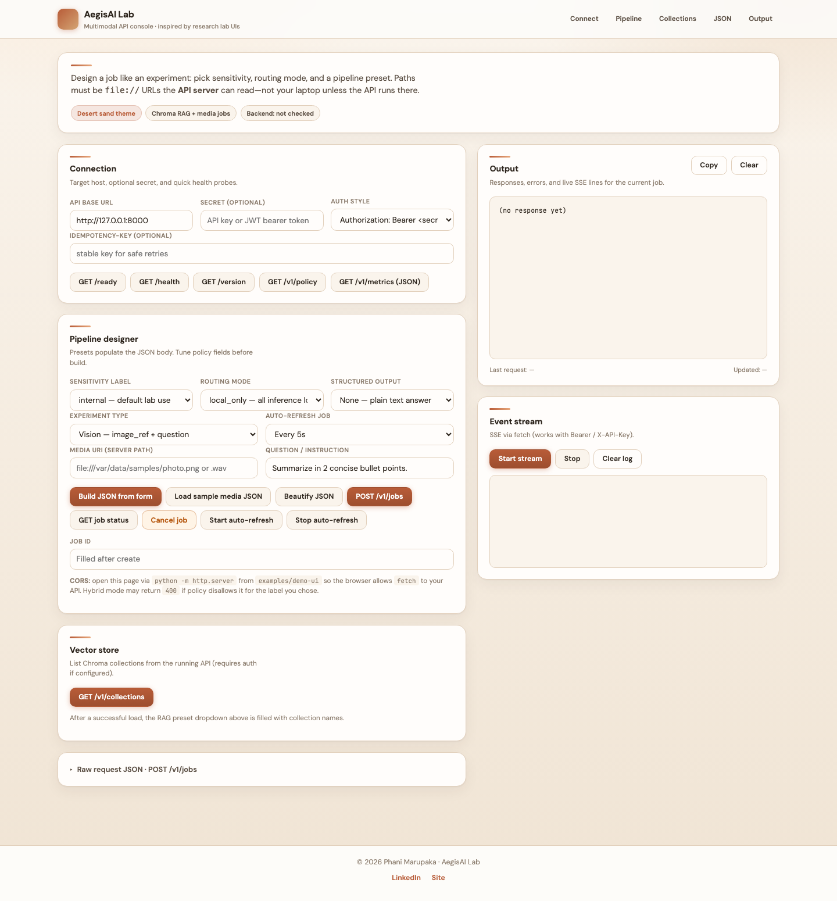
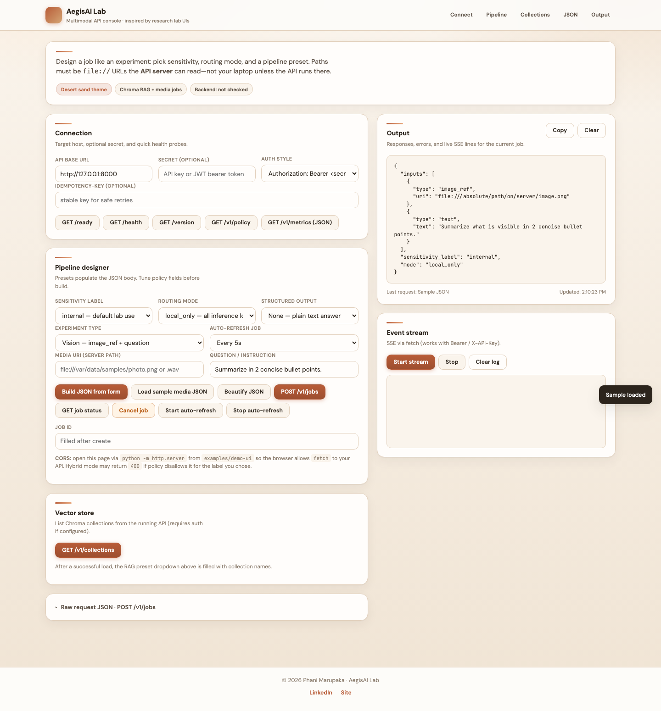
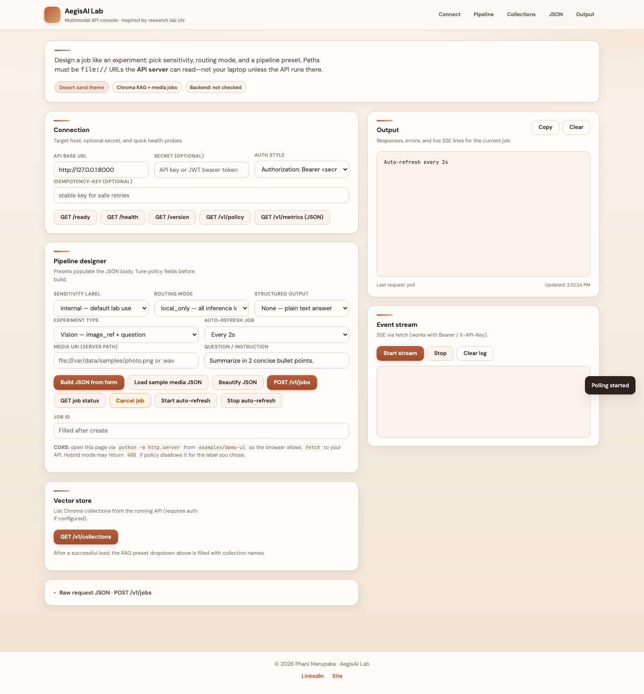

# AegisAI

[](https://github.com/Phani3108/AegisAI/actions/workflows/ci.yml)

**Local-first FastAPI service** for multimodal jobs (vision, video, documents, audio / ASR, Chroma RAG) with **Ollama**, policy-aware hybrid routing, metrics, Docker, and Helm.

| | |
|--|--|
| **Repository** | [github.com/Phani3108/AegisAI](https://github.com/Phani3108/AegisAI) |
| **Full architecture & roadmap** | [planning.md](planning.md), [docs/strategy/expansion_roadmap.md](docs/strategy/expansion_roadmap.md) |
| **Task checklist** | [tasks.md](tasks.md) |
| **Environment reference** | [.env.example](.env.example) |
| **HTTP examples** | [examples/http/smoke.http](examples/http/smoke.http) |
| **OpenAPI / clients** | [docs/integrators/SDK.md](docs/integrators/SDK.md) |

---

## What you get

- **Async jobs** — `POST /v1/jobs` with `image_ref`, `video_ref`, `document_ref`, `audio_ref`, optional `video_transcribe`, or Chroma-only `rag_collection` + text question.
- **Live API docs** — `/docs` and `/openapi.json`.
- **Operator Lab UI** — static console under [`examples/demo-ui/`](examples/demo-ui/) (run with any HTTP server).
- **Production hooks** — `/live`, `/ready`, Prometheus `/metrics`, optional API key, Helm chart under `deploy/helm/`.

---

## Lab UI — screenshots

Expand one panel at a time (works well on GitHub):

<details>
<summary><strong>1 / 3</strong> — Dashboard (connection + pipeline)</summary>



</details>

<details>
<summary><strong>2 / 3</strong> — Sample job JSON loaded</summary>



</details>

<details>
<summary><strong>3 / 3</strong> — Auto-refresh polling on</summary>



</details>

**Regenerate** (Playwright): `pip install playwright && playwright install chromium` then `python3 scripts/capture_demo_screenshots.py`.

---

## Quick start

**Docker Compose** (app + Ollama):

```bash
docker compose up --build
# API: http://127.0.0.1:8000/docs
```

**Local Python**:

```bash
pip install -e ".[dev]"
uvicorn aegisai.main:app --reload --host 127.0.0.1 --port 8000
```

**Lab UI** (point the form at your API URL):

```bash
cd examples/demo-ui && python3 -m http.server 7001
# http://127.0.0.1:7001/index.html
```

---

## Common API paths

| Method | Path | Purpose |
|--------|------|---------|
| GET | `/ready` | Dependencies OK (for load balancers) |
| GET | `/docs` | Swagger UI |
| POST | `/v1/jobs` | Create async job |
| GET | `/v1/jobs/{id}` | Job status, events, result |
| POST | `/v1/query` | Sync chat (bounded timeout) |
| POST | `/v1/stream/chat` | SSE streaming chat |
| — | `/v1/collections/*` | Chroma collections + ingest |

---

## Configuration

All tunables use the **`AEGISAI_`** prefix. See **[.env.example](.env.example)** for the full list (models, timeouts, Redis, ASR, remote fetch allowlists, etc.).

---

## Development & CI

```bash
pytest -q
# or full gate (Ruff, tests, build):
bash scripts/qa_verify.sh
```

---

## License

[MIT](LICENSE)

**Lab UI** includes author attribution assembled from [`examples/demo-ui/internal/attribution/`](examples/demo-ui/internal/attribution/) — keep those modules when redistributing the console.
