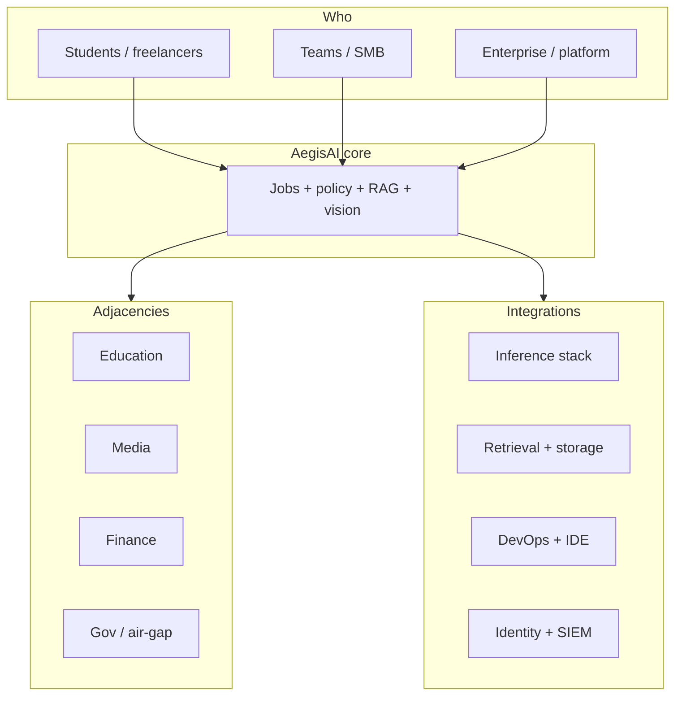

# AegisAI — Expansion roadmap (industries, personas, integrations)

**Audience:** Product and engineering planning.  
**Companion:** [planning.md](../../planning.md) (tiers T0–T5, architecture), [tasks.md](../../tasks.md) (execution checklist).

This document answers: *where can AegisAI win*, *who uses it at each depth*, *what to integrate next*, and *how to phase delivery* without losing the **local-first / policy-first** spine.

---

## 1. Core wedge (what we do not dilute)

| Principle | Implication for expansions |
|-----------|----------------------------|
| **Data stays close** | New integrations default to **optional**; sensitive paths stay **local_only**. |
| **Policy before inference** | Every new tool (search, CRM, cloud model) is a **policy-gated capability**, not a silent dependency. |
| **Same job contract** | `JobRequest`, events, metrics, idempotency remain the **stable integrator surface**; backends plug in behind. |

---

## 2. Industries and adjacencies

“Adjacency” = same technical motion (ingest → perceive → retrieve → reason → audit) with different corpus, compliance, and UI.

| Industry / adjacency | Why AegisAI fits | Typical data | Expansion lever |
|---------------------|------------------|--------------|-----------------|
| **Software & IT** | Docs, runbooks, tickets, code | Repos, Confluence, Jira | RAG + structured `output_schema` |
| **Legal / compliance** | Clause extraction, redlines | PDFs, contracts | OCR + long-context + audit export |
| **Healthcare / life sciences** | Literature, protocols (non-diagnostic assist) | Papers, SOPs | Strict labels, air-gap tier T3 |
| **Finance / insurance** | Policies, filings, KYC *text* (not advice) | PDFs, tables | DLP + hybrid off by default |
| **Manufacturing / ops** | Manuals, inspection images | Images + PDFs | Vision + video sampling |
| **Media / education** | Lectures, scripts | Video + transcripts | ASR adjacency + chapter RAG |
| **Retail / CX** | Product Q&A, returns policy | KB + images | Low-latency query path |
| **Gov / defense** | Classified-style isolation | Air-gap | T3 bundle, no outbound |
| **Research / academia** | Papers, experiments | PDFs, figures | Benchmarks + reproducibility |
| **Creative / marketing** | Briefs, brand guidelines | Mixed media | Structured outputs, human-in-loop |

*Disclaimer:* Vertical claims require your own compliance review; the stack provides **technical controls** (labels, local-only, audit), not legal certification.

---

## 3. Use-case depth: small → medium → large

### 3.1 Small (hours–days to value)

| Use case | User | What they do | Outcome |
|----------|------|--------------|---------|
| **Local chat + one doc** | Student, hobbyist | `document_ref` or tiny RAG collection | Learn APIs, no cloud bill |
| **Screenshot Q&A** | Freelancer | `image_ref` + question | Quick client deliverable |
| **Policy playground** | Any | Lab UI + `GET /v1/policy` | Understand routing before prod |
| **Smoke benchmark** | Engineer | `scripts/benchmark_baseline.py` | Baseline latency snapshot |

**Product implication:** frictionless Docker path, great demo UI, clear errors, minimal config.

### 3.2 Medium (days–weeks)

| Use case | User | What they do | Outcome |
|----------|------|--------------|---------|
| **Team KB** | Startup / agency | Chroma ingest + RAG jobs | Shared internal answers |
| **Video rough cut summary** | Creator, PM | `video_ref` + sampling policy | Chapter bullets, timestamps |
| **CI-friendly API** | Developer | OpenAPI clients + idempotency | Automated pipelines |
| **Auth + quotas** | Team lead | API key / JWT + rate limits | Shared server, abuse control |

**Product implication:** Redis-backed idempotency, metrics dashboards, collection management, webhook or poll for job completion.

### 3.3 Large (weeks–months)

| Use case | User | What they do | Outcome |
|----------|------|--------------|---------|
| **Multi-tenant platform** | Platform team | Namespaces, SSO, per-tenant policy | Internal “AI service” |
| **Hybrid with guardrails** | Enterprise | DLP + allowlisted cloud burst | Cost/latency where safe |
| **Vertical pack** | Vendor / SI | Curated prompts + eval sets | Repeatable industry SKU |
| **Federated ops** | Org with regions | Per-region inference + central audit | Data residency patterns |

**Product implication:** worker pools, stronger RBAC, external audit sinks, model registry, cost attribution, SLAs.

---

## 4. Personas (freelancer → deep professional)

| Persona | Goals | Depth they need | What we should expose |
|---------|--------|-----------------|------------------------|
| **Student / learner** | Learn multimodal + RAG | Examples, sandboxes | Lab UI, notebooks, `/docs` |
| **Freelancer** | Ship client demos fast | Templates, export | Preset jobs, structured JSON, screenshots |
| **Indie developer** | Embed in app | Stable API, SDKs | OpenAPI, typed clients, webhooks (future) |
| **Startup engineer** | Team KB + metrics | Docker + Redis + CI | Helm, runbooks, benchmarks |
| **Enterprise architect** | Policy, HA, audit | Reference deployments | OIDC, SIEM, PDB/HPA patterns |
| **ML / platform lead** | Model choice + eval | Registry + regression | Multiple backends, eval harness |
| **Security engineer** | Threat model | Prove boundaries | Pen-test notes, egress deny, log redaction |

---

## 5. Integration map (wide + deep)

Below: **clusters** of tools. Implementation order should follow [§6 Phased build](#6-phased-build-what-we-build-next).

### 5.1 Inference & models (AI core)

| Layer | Examples | Depth |
|-------|----------|--------|
| **Local OSS** | Ollama (today), llama.cpp, vLLM, Triton | Swap `InferenceBackend`; unify health + model list |
| **Cloud APIs (policy-gated)** | Azure OpenAI, Vertex, Bedrock | Optional `hybrid` routes; budget + content safety |
| **Embeddings** | Ollama, `sentence-transformers`, cloud embed APIs | Pluggable `EmbedBackend` |
| **Speech** | faster-whisper, Whisper API | New job type or pre-step on video |
| **OCR** | Tesseract, PaddleOCR, Document Intelligence | Pre-ingest for `document_ref` |

### 5.2 Retrieval & data

| Layer | Examples | Depth |
|-------|----------|--------|
| **Vector DB** | Chroma (today), Qdrant, Milvus, LanceDB, pgvector | `Retriever` interface; migration tooling |
| **Document stores** | S3, Azure Blob, GCS | Signed URL or sidecar ingest |
| **Warehouses** | BigQuery, Snowflake (export → embed) | Batch ingest jobs |
| **Graph / KB** | Neo4j, GraphRAG patterns | Optional retrieval mode |

### 5.3 Developer & workflow tools

| Layer | Examples | Depth |
|-------|----------|--------|
| **CI/CD** | GitHub Actions, GitLab, Azure DevOps | Publish OpenAPI; contract tests |
| **IaC** | Terraform, Bicep, Helm (started) | One-click reference modules |
| **IDE** | VS Code / Cursor rules, MCP server | “Ask AegisAI” from editor |
| **Automation** | n8n, Zapier, Make | HTTP nodes calling `/v1/jobs` |
| **Notebooks** | Jupyter, Marimo | Official snippet library |

### 5.4 Collaboration & content

| Layer | Examples | Depth |
|-------|----------|--------|
| **Docs** | Notion, Confluence, Google Docs | Export → ingest pipeline (batch) |
| **Tickets** | Jira, Linear, ServiceNow | Summarize + link to RAG corpus |
| **Chat** | Slack, Teams | Bot posts job results; approval flows |
| **Code** | GitHub, GitLab | PR summary jobs (local clone + policy) |

### 5.5 Security, identity, observability

| Layer | Examples | Depth |
|-------|----------|--------|
| **Identity** | Entra ID, Keycloak, Auth0 | OIDC/JWT (started), tenant claims |
| **Secrets** | Vault, AKV, GSM | No keys in UI logs |
| **Observability** | Prometheus, Grafana, OTEL (optional), Datadog | Same metrics; exporter cards |
| **SIEM** | Splunk, Sentinel, Elastic | Audit NDJSON sink (started path) |

### 5.6 Agentic & tools (future-facing)

| Pattern | Examples | Depth |
|---------|----------|--------|
| **Tool calling** | MCP, OpenAI tools, custom JSON tools | Allowlisted HTTP tools + local tools |
| **Orchestration** | LangGraph, Temporal, Celery | Durable workflows beyond single job |
| **Evaluation** | Ragas, custom golden sets | CI gate on RAG quality |

---

## 6. Phased build (what we build next)

Phases are **ordered for dependency and risk**: deepen local core → integrator surfaces → external systems.

| Phase | Theme | Deliverables (examples) | Unlocks |
|-------|--------|-------------------------|---------|
| **P19** | **Inference abstraction** | `InferenceBackend` protocol; Ollama adapter only at first; feature flag second backend | Multi-model ops without API churn |
| **P20** | **Ingest connectors (read-only)** | S3/Blob fetcher + virus-scan hook stub; batch `POST /v1/collections/.../documents` improvements | Medium use cases without file:// only |
| **P21** | **ASR path** | Optional `audio_ref` or video→transcript stage; store segments in events | Media / education adjacency |
| **P22** | **Webhook / callback** | `callback_url` on job (signed); retry policy | n8n, Slack, CI |
| **P23** | **MCP or “tools” allowlist** | Documented MCP server wrapping `/v1/*` | IDE + agent ecosystems |
| **P24** | **Cloud burst (controlled)** | Azure OpenAI adapter behind policy + budget counters | Large enterprise latency/cost |
| **P25** | **Vertical pack template** | Repo template: prompts + eval JSON + routing_policy snippet | Partners / SIs |

Each phase should ship with: **tests**, **OpenAPI delta**, **planning/tasks/log** one-liner, **demo UI slice** if user-visible.

---

## 7. How to use this doc

1. **Pick 1–2 adjacencies** you care about commercially (e.g. IT + legal).  
2. **Map them to S/M/L** rows to define MVP stories.  
3. **Select integrations** from §5 that match those stories — avoid “integrate everything.”  
4. **Sequence** with §6; after each phase, re-run benchmarks + runbook drills.

---

## 8. Summary diagram

---

*Last updated: strategy pass — expansion + integrations depth (see repository commit history).*
