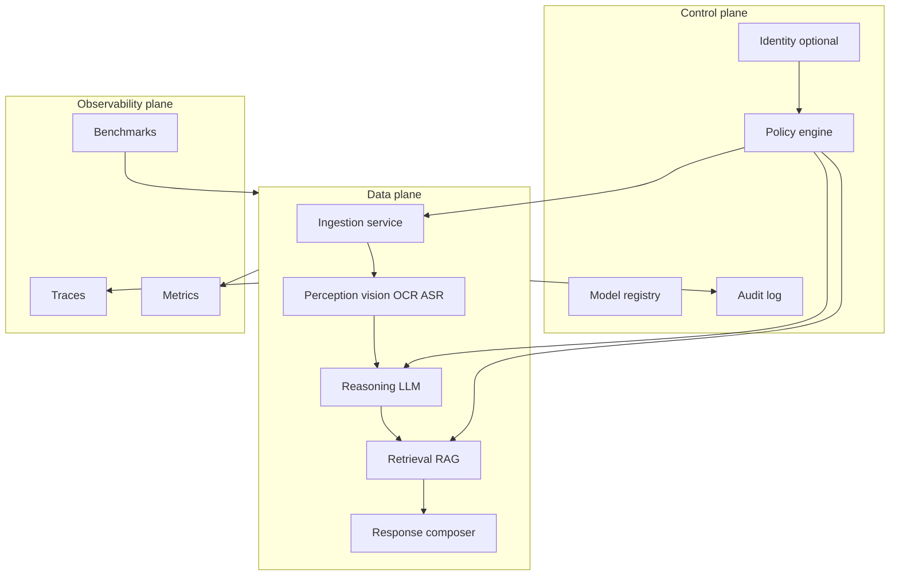

# AegisAI — Local Multimodal Stack (Enterprise Privacy Engine)

**Purpose:** Living strategy and architecture specification. Update when direction, constraints, or integrations change.  
**Companion files:** `tasks.md` (checklist), `LOG.md` (prompt + completion audit trail).

**Phase 0 implementation stack (accepted):** Python **3.11+**, **FastAPI**, **Uvicorn**, **Pydantic v2**; package layout `src/aegisai/`. Rationale: [`docs/adr/0001-python-fastapi-control-plane.md`](docs/adr/0001-python-fastapi-control-plane.md).

---

## 1. Vision and expansion horizons

The project can grow along maturity tiers. Each tier reuses the same core abstractions (ingest → perceive → reason → retrieve → respond → observe).

| Tier | What it is | Typical buyer / user | Expansion focus |
|------|------------|----------------------|-----------------|
| **T0 Research lab** | Single-machine Ollama + vision + RAG + benchmarks | You, R&D | Model matrix, eval harness, reproduce results |
| **T1 Team appliance** | Shared Docker host or small GPU server, shared model cache | Eng team | AuthN/Z light, quotas, job queue |
| **T2 Internal platform** | Multi-user, namespaces, policy, audit export | Enterprise IT | SSO, DLP hooks, SIEM, HA |
| **T3 Air-gap / regulated bundle** | Offline install, signed artifacts, SBOM | Finance / health / gov | Hardening, provenance, validation playbooks |
| **T4 Hybrid intelligence** | Strict local default + optional *non-sensitive* cloud burst | Cost/latency optimization | Router v2, budgets, cryptographic optional (future) |
| **T5 Vertical packs** | Domain prompts, eval sets, retrieval corpora | Industry GTM | Compliance mapping (e.g. HIPAA patterns), not legal advice |

**Skill-building alignment (your goals):**

- **Image & video models:** Maintain a **model capability matrix** (modality, context length, tool-calling, OCR strength, video need: frames vs native video model).
- **Observability:** Every tier still emits the same **spans/metrics**; only backends change (file → Prometheus → corporate monitoring).
- **Real-time:** Introduce **streaming contracts** early in API design even if v1 is batch-only.
- **Fine-tuning:** Treat as **optional pipeline** with isolated data contracts and benchmark regression gates.

---

## 2. Reference architecture (logical)

**Principles:**

- **Policy before inference:** routing (local vs cloud), allowed tools, and retention are decided with explicit inputs (labels, user scope, org rules).
- **Swap-friendly inference:** one interface (`generate`, `embed`, `vision`, `transcribe`) with multiple backends (Ollama, vLLM, etc.).
- **Eval as code:** benchmarks are versioned; model or prompt changes require a benchmark run artifact.

---

## 3. Integration catalog (what can plug in)

### 3.1 Model serving (text / multimodal)

| Integration | Role | When to use |
|-------------|------|-------------|
| **Ollama** | Default local stack, fast iteration | Dev, single-node |
| **llama.cpp** / **Metal** | Low-level control, edge | Apple Silicon tuning |
| **vLLM** | Throughput, batch APIs | Shared GPU server |
| **TensorRT-LLM** / **Triton** | Latency-sensitive production | NVIDIA-heavy orgs |
| **ONNX Runtime** | Cross-vendor deployment | Mixed hardware |

**Spec:** each backend implements `InferenceBackend` with: `health()`, `list_models()`, `chat()`, `embed()`, optional `vision_completion()`.

### 3.2 Vision and media

| Integration | Role |
|-------------|------|
| **ffmpeg** | Decode, resize, fps, keyframes, thumbnails |
| **OpenCV** / **Pillow** | Batch image ops, drawings |
| **PySceneDetect** (optional) | Scene boundaries for video |
| **VLMs** (LLaVA, Qwen-VL, Florence-2 class, etc.) | Caption, VQA, structured extraction |
| **OCR** (Tesseract, PaddleOCR, doc libraries) | Dense text in UI screenshots, scans |

**Spec:** `VisionPipeline` input: `MediaRef` + `SamplingPolicy`; output: `VisualEvidence` (caption, boxes optional, per-frame or per-scene timeline).

### 3.3 Speech (video narratives, meetings)

| Integration | Role |
|-------------|------|
| **whisper.cpp** / **faster-whisper** | Local ASR |
| Optional diarization later | Speaker separation |

**Spec:** `AudioPipeline` output aligns to video timeline (segments with `start_ms`, `end_ms`).

### 3.4 Retrieval and memory

| Integration | Role |
|-------------|------|
| **Chroma**, **Qdrant**, **LanceDB**, **Milvus**, **pgvector** | Vector store |
| **sqlite** + FTS5 or **OpenSearch** (heavier) | Lexical / hybrid |

**Spec:** `Retriever` supports `hybrid(query, filters)` and `ingest(documents, metadata)`; document metadata includes **classification label** and **retention**.

### 3.5 Enterprise and security (T2+)

| Integration | Role |
|-------------|------|
| **OIDC** (Keycloak, Entra ID, etc.) | SSO |
| **DLP** (vendor API or regex/SPII rules) | Pre-send gate for hybrid mode |
| **SIEM** (Splunk, Azure Sentinel, Elastic) | Audit sink |
| **Vault** / cloud secret stores | Secrets outside env files |

### 3.6 Real-time delivery (future)

| Integration | Role |
|-------------|------|
| **WebSocket** / **SSE** | Streaming tokens and progress |
| **WebRTC** | Low-latency media (advanced; only if needed) |
| **Redis** / **NATS** | Fan-out job status, queue |

### 3.7 MLOps and artifacts (fine-tuning track)

| Integration | Role |
|-------------|------|
| **MLflow** or **DVC** | Experiment + dataset lineage |
| **Hugging Face PEFT** | LoRA/QLoRA workflows |

**Spec:** fine-tuned weights are **new entries in model registry**, never silent overwrite of baselines.

---

## 4. Design specifications (product + API)

### 4.1 API surface (recommended)

- **REST + OpenAPI 3.1** for: `POST /v1/jobs` (batch), `GET /v1/jobs/{id}`, `POST /v1/query` (sync where bounded).
- **Optional WebSocket** `/v1/stream` for: token stream, stage progress (`vision_done`, `retrieval_hits`).
- **Idempotency-Key** header on job creation for safe retries.

**Core schemas:**

- `JobRequest`: `inputs[]`, `sensitivity_label`, `mode` (`local_only` | `hybrid`), `output_schema` (optional JSON Schema for structured answers).
- `JobEvent`: append-only audit (**no raw secrets**); includes `route_decision`, `models_used`, `latency_ms_breakdown`.

### 4.2 Policy UX

- Explicit **sensitivity toggle** and **“why local”** tooltip (trust, not jargon).
- **Preview** of what would be sent if hybrid is on (redacted/snippet only).

### 4.3 Non-functional UX

- Progress for long video: **stage bar** (extract → sample → perceive → reason).
- Error messages: actionable (“reduce frames”, “model too large for VRAM”) with link to model registry row.

---

## 5. Architecture specifications (engineering)

### 5.1 Non-functional requirements (draft targets — tune per hardware)

| Measure | T0 lab target | T2 platform direction |
|---------|---------------|------------------------|
| Sync query upper bound | Configurable timeout (e.g. 120s) | SLO per tenant tier |
| Video | Max duration / max frames cap | Queue + async |
| Availability | Best effort | HA inference pool, graceful degradation |
| Security | Local disk encryption optional | Central audit, secret rotation |

### 5.2 Data classification and retention

- Labels: `public` / `internal` / `confidential` / `regulated` (example set — align to your org).
- **Retention policy** per label: e.g. no persistence for `regulated` except aggregated metrics.
- **Router:** `regulated` → `local_only` + disable cloud tools.

### 5.3 Threat model (starter)

- **Assets:** user media, prompts, embeddings, logs.
- **Adversaries:** malicious insider (exfil via hybrid), compromised dependency, cross-tenant leak (T2).
- **Mitigations:** default-deny outbound in local-only mode; signed images; minimal log content; sanitize filenames; network namespace isolation in Compose/K8s.

### 5.4 Deployment topologies

1. **Laptop:** Ollama + app + SQLite/Chroma embedded.
2. **GPU server:** vLLM + shared Qdrant; reverse proxy TLS.
3. **Kubernetes:** separate `inference`, `api`, `vector`, `observability` namespaces; GPU node selectors.

### 5.5 Observability specification

**Required dimensions per request:** `trace_id`, `job_id`, `sensitivity_label`, `route`, `model_ids`, `stages` (`ingest_ms`, `vision_ms`, `llm_ms`, `retrieval_ms`), `tokens_in/out`, `vram_peak_mb` (if available), `quality_score` (from benchmark hooks).

**“Cost saved” metric:** compare against a **reference cloud tariff** config (YAML), same token estimates — clearly labeled as **estimate**, not invoice.

### 5.6 Benchmark specification

- **Datasets:** frozen version + checksum; subset marked **never leave machine**.
- **Tasks:** VQA, captioning, doc QA, video summary (with fixed sampling).
- **Comparators:** local runs always; optional **external judge** only on non-sensitive gold set.
- **Artifacts:** JSON reports under `runs/benchmarks/<git-sha-or-date>/` with hardware snapshot.

### 5.7 Architecture Decision Records (ADRs)

Maintain `docs/adr/NNNN-title.md` for irreversible choices (vector DB, router policy language, streaming protocol). Template: context, decision, consequences.

---

## 6. Real-time multimodal path (gap closure)

Phased approach to avoid overbuilding:

1. **Async jobs + polling** — ship first; define `JobEvent` stream schema.
2. **SSE/WebSocket** — stream LLM tokens; push stage transitions from vision/RAG.
3. **Chunked video** — user selects “quick skim” vs “deep”; different `SamplingPolicy`.
4. **True low-latency** — only after profiling shows network is bottleneck; consider edge decode + smaller VLM pass first.

---

## 7. Fine-tuning path (gap closure)

- **Data contract:** One can only fine-tune on labeled data approved for training use.
- **Experiments:** Must register hyperparameters + dataset hash in MLflow/DVC.
- **Gate:** promote fine-tuned model only if **benchmark suite** improves or holds within Δ on safety/accuracy suite you define.

---

## 8. What “done” means per phase (high level)

- **Phase 0:** One image path end-to-end local; minimal benchmark; logging to disk.
- **Phase 1:** Video (keyframes) + optional ASR; hybrid router stub; OTEL-ready spans.
- **Phase 2:** Platform hardening (auth, audit export); deployment guides.
- **Phase 3:** Real-time streaming UX; optional fine-tune pipeline.

---

## 9. Decisions

**Accepted**

- HTTP control plane: **FastAPI** (see ADR 0001).

**Open**

- Primary vector store for T0–T1.
- Whether hybrid mode is in scope for v1 or deferred.
- Target hardware baseline (VRAM tier) for default model set.

---

*Last updated: Phase 6 (JSON logs, WS API-key parity, CI Docker build).*
